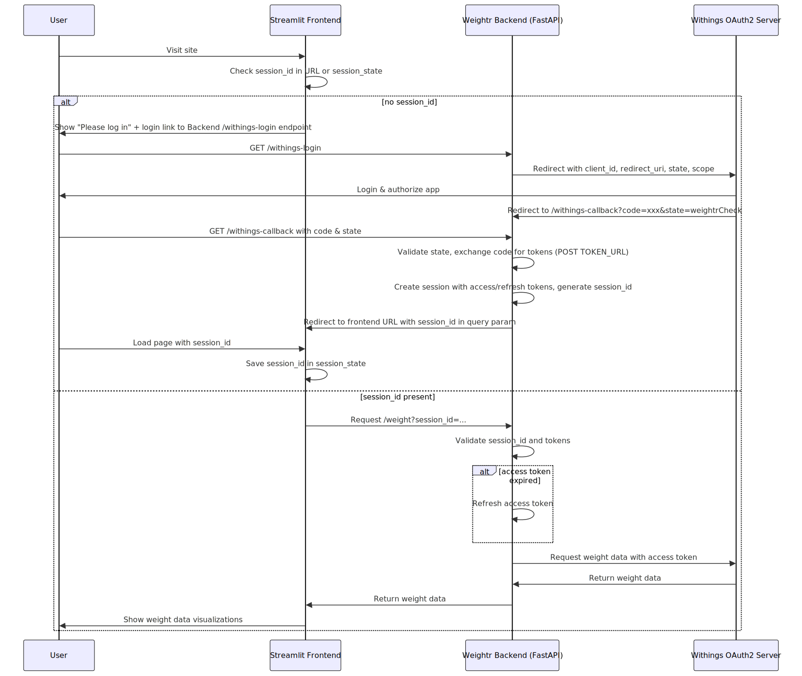

# Auth flow

## Overview
- The frontend first checks for a session ID from the URL or local session state.

- If no session ID exists, it shows a login link that points to the backend's /withings-login endpoint.

- Backend redirects the user to the Withings OAuth2 authorization page.

- After successful login and authorization on Withings, Withings redirects to backend's /withings-callback with an authorization code.

- Backend exchanges the code for access and refresh tokens, creates a session, and generates a unique session_id.

- Backend redirects the user back to the frontend, passing session_id as a URL query parameter.

- Frontend saves this session_id for subsequent requests.

- When fetching weight data, the frontend calls backend /weight endpoint with session_id.

- Backend validates session, refreshes token if expired, fetches weight data from Withings API, and returns it to the frontend.

- Frontend shows the weight data to the user.

## Diagrams
### Sequence

### Component

### Flowchart

